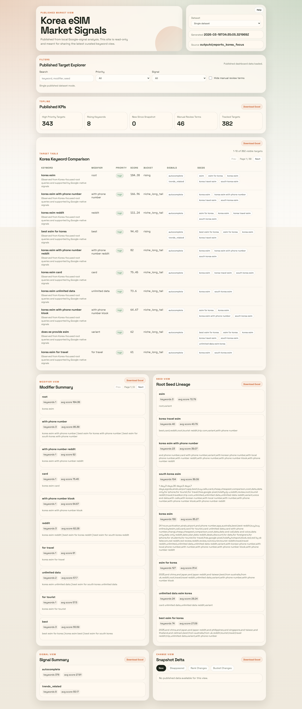

# KeywordAnalysis

공개 Google 신호만 사용해 미국 사용자의 eSIM 검색 수요를 조사하고, 한국 eSIM 중심 키워드를 비교·우선순위화하는 Python 기반 분석 프로젝트입니다.

## 현재 README 평가

기존 README는 다음 기준에서는 기본 요건을 충족했습니다.

- 프로젝트 범위가 분명했습니다.
- 주요 디렉터리 역할이 정리되어 있었습니다.
- Streamlit 대시보드와 Public Dashboard의 구분이 있었습니다.
- 배포 시 주의할 비공개 산출물이 명시되어 있었습니다.

다만 현재 기준에서는 아래 보완이 필요했습니다.

- 설치와 실행 절차가 사용자 관점에서 충분히 구체적이지 않았습니다.
- 영어로만 작성되어 국내 협업 환경에서 바로 읽기 불편했습니다.
- 실제 실행 화면 예시가 없어 결과물을 빠르게 이해하기 어려웠습니다.

이 문서는 위 항목을 반영해 한글로 다시 정리한 버전입니다.

## 프로젝트 범위

- Google Search 기반 수집만 사용
- 공개 신호만 사용
- 미국 영어 검색 가정 적용: `hl=en`, `gl=us`
- Google 내부 검색 로그는 사용하지 않음
- eSIM, travel eSIM, 국가별 eSIM 수요 패턴 분석에 집중

## 주요 구성

- `src/keyword_analysis/`: 수집, 정규화, 분류, 리포트 생성 코드
- `config/`: 수집 프로필과 실행 설정
- `outputs/`: SQLite, CSV, Markdown 등 생성 산출물
- `site/`: GitHub Pages용 정적 Public Dashboard
- `docs/`: 운영 문서, 배포 가이드, 리서치 메모

## 전체 흐름

1. Seed keyword를 정의합니다.
2. Google autocomplete, related searches, Trends 데이터를 수집합니다.
3. 수집한 키워드를 정규화하고 intent를 분류합니다.
4. 키워드 우선순위를 계산하고 시계열 변화를 추적합니다.
5. Streamlit 대시보드와 정적 Public Dashboard용 산출물을 만듭니다.

## 설치

Python `3.11+` 환경에서 아래처럼 설치합니다.

```bash
python -m pip install -e .
```

`pyproject.toml` 기준 주요 의존성은 다음과 같습니다.

- `pandas`
- `playwright`
- `pytrends`
- `pyyaml`
- `requests`
- `streamlit`

## 로컬 대시보드 실행

기본 운영 화면은 Streamlit 대시보드입니다.

```bash
streamlit run src/keyword_analysis/dashboard.py
```

기본값으로 아래 산출물을 읽습니다.

- 보고서 디렉터리: `outputs/reports_korea_focus/`
- 데이터베이스: `outputs/keyword_analysis.sqlite3`

대시보드에서 할 수 있는 작업은 다음과 같습니다.

- 한국 eSIM 키워드 우선순위 비교
- modifier, signal, seed lineage 확인
- snapshot 간 신규/감소/변동 키워드 확인
- 필요 시 `Refresh Market Signals`로 데이터 재생성

## 실행 화면 예시

아래 이미지는 2026-03-24 기준 현재 프로젝트의 최신 Public Dashboard 전체 화면입니다.



## Public Dashboard 생성

외부 공개용 화면은 `site/` 아래의 읽기 전용 정적 사이트입니다.

공개용 JSON 번들은 아래 명령으로 생성할 수 있습니다.

```bash
python -c "from pathlib import Path; from keyword_analysis.pipeline import export_korea_public_dashboard; export_korea_public_dashboard(output_dir=Path('site/data'))"
```

생성 결과:

- `site/data/dashboard_data.json`
- `site/data/dashboard_manifest.json` (여러 published dataset을 함께 둘 때)

`dashboard_manifest.json`이 있으면 정적 사이트는 dataset selector를 보여주고, 선택한 dataset JSON만 읽습니다. manifest가 없으면 기존처럼 `dashboard_data.json` 단일 파일만 읽습니다.

정적 사이트를 로컬에서 확인하려면 저장소 루트에서 HTTP 서버를 띄운 뒤 `site/`를 브라우저로 열면 됩니다.

## 수집 및 품질 관련 메모

- Seed export는 autocomplete만이 아니라 해당 seed에서 실행된 전체 collector 결과를 집계합니다.
- autocomplete 확장은 `config/collection_profiles.yaml`의 `autocomplete_expansion` 설정을 따릅니다.
- `related_search`는 best-effort 수집이며, selector miss 또는 anti-bot 응답은 실패 로그로 기록됩니다.
- SQLite의 `collection_runs`는 실행 이력을 유지하고, `observations`는 동일 payload가 반복 적재될 때 중복 row가 쌓이지 않도록 deduplicate 됩니다.
- 현재 테스트는 export aggregation, query expansion, config defaults, related-search failure handling 등을 포함합니다.

## 배포 및 공개 시 주의사항

Public Dashboard는 실시간 분석 시스템이 아니라 게시용 스냅샷입니다.

공개 가능한 산출물:

- `site/index.html`
- `site/styles.css`
- `site/app.js`
- `site/data/dashboard_data.json`

공개하면 안 되는 산출물:

- `outputs/*.sqlite3`
- `outputs/reports/collection_failures.log`
- 임의의 로컬 snapshot 경로
- 로컬 파일시스템 설정값

자세한 운영 절차는 아래 문서를 참고합니다.

- `docs/github_pages_deployment.md`
- `docs/public_dashboard_operations.md`

## 브랜치 운영

- 기능 개발은 예: `feature/public-dashboard` 브랜치에서 진행
- `main` 브랜치를 Python 코드, 정적 사이트, 문서의 기준 브랜치로 유지
- 가능하면 `gh-pages`를 수동 관리하지 말고 GitHub Actions 기반 Pages 배포 사용

권장 흐름:

1. 기능 브랜치에서 개발 및 검증
2. `main`으로 Pull Request 생성
3. GitHub Actions가 Pages artifact 배포
